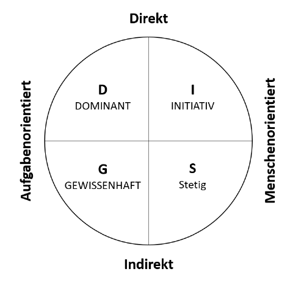
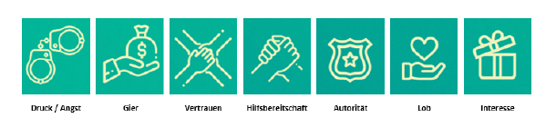

# Zusammenfassung Social Engineering

# Inhaltsverzeichnis

## 1.2 Definition Social Engineering

Beschreibt jede Handlung, die Person beinflusst, eine Handlung zu unternehmen, in gutem als auch schlechtem Interesse

## 1.3 Geschichte und Motivation

Prinzip:Annahme, dass
ein Mensch wie eine Maschine verbessert werden kann: Optimierung von Menschen

Kontext InfoSec: gezielte Manipulation von Einzelpersonen oder Gruppen

Motivation unterschiedlich: 

- soziale Gründe: Rache, Spaß, Macht
- professionelle Gründe: Industriespionage, Identitätsdiebstahl

## 1.4 Social Engineering im Alltag

- Informationen sind der Schlüssel
- Vertraue, aber überprüfe
- Informationen begrenzen und überwachen

# Angriffsmechanismen

## 2.1

### 2.1.1 Vorurteile und Klischees

- Denken ist der Feind des Social Engineerings
- Schwangere Frauen: Inbegriff für Gutes
- Personen it irischem Akzent: gastfreundlich, lustig, gesellig

### 2.1.2 Einordnung von Charaktertypen

Einschätzen von Charaktertypen und Wählen der richtigen Strategie

Unterscheidung Kommunikationsstil: Rolle autoritär oder zurückhaltend wählen.

### 2.1.3 Social Engineering und die Psychologie

Grundlagen der Psychologie

#### Reziprozität

Gegenseitigkeit oder Wechselbezüglichkeit und stellt ein Grundprinzip menschlichen Handelns dar.

Prinzip:
- Person A erweist Person B eine Gefälligkeit
- Anschließend verlangt Person B eine Gefälligkeit zurück

#### Konsistenz

Wenn ENtscheidung bewusst getroffen wurde, treten intra- und nterpsychische Vorgänge ein.

- Motiv der Konsistenz so groß, dass etwaige Umentscheidung verworfen wird, um nach außen konsistent zu wirken.

#### Soziale Bewährtheit

Verhalten anderer wird als richtig angenommen und ggf. kopiert. Wirkt besonders stark, je mehr Unsicherheit und Unklarheit involviert ist.

#### Sympathie

Attraktiven Menschen werden positive Eigenschaften zugeschrieben. 

- Gleiche Kleidung
- Gleiche Herkunft
- ...

sorgen für Sympathie mit anderen.

#### Autorität

Faktoren:

- Titel
- Uniformen
- Luxus

#### Knappheit

Einschränkung von Verfügbarkeit beinflusst Wahrnehmung von Qualität.

Knappheitsprinzip:, Möglichkeiten erscheinen umso wertvoller, je weniger erreichbar sie sind.

#### Abschlussbemerkung 

Ziel ist es, andere dazu zu bringen, eine Entscheidung zu treffen, ohne nachzudenken.

### 2.1.4 Biologische Grundlagen

#### Alpha-/Beta-Modus

Im Alpha-Modus arbeitet Gehirn mit 8 bis 13 cps (zyklen pro Sekunde) :arrow_right: Tagträumen, enstspannen, fokussierte Konzentration

Im Beta-Modus 14 bis 100 cps. Gehirn ist wach, aufmerksam, nimmt Dinge auf, die um uns herum passieren.

Social ENgineering setzt auf Alpha-Modus. Handeln ohne großes Nachdenken von Vorteil.

Vom emotionalen Denken bis zum logischen Handeln dauert es etwa 30 Sekunden. Diese Zeit reicht häufig bereits aus, um Social Engineering zu Nutze zu machen.
Erst danach fällt Betroffenem auf, was er getan hat.

#### Bindungstheorie

Andauerndes affektives Bindungsverhältnis zu bestimmten Personen.

Suchen nach körperlicher und psychischer Nähe.

Bezugsperson hat damit hohen EInfluss auf Entscheidungsfindung einer Person.

#### Oxytocin - The Molecule of Trust

Kuschelhormon. Kann EIgenschaft des Vertrauens hervorrufen

#### Das Experiment rund ums Vertrauen

- Teilnehmern werden 10 Dollar versprochen
- Geld weiter senden wird verdreifacht
  - empfangende Person sendet etwas davon zurück
- Je mehr Geld 2. Person erhält, desto mehr Oxytocin hatte diese Person im Blut
  - Je mehr Oxytoci, desto mehr Geld wurde wieder weitergegeben

Oxytocin verbindet mit anderen, lässt fühlen, was andere fühlen und lässt Menschen großzügiger werden.

#### Dopamin - The Molecule of More

Wichtiger Neurotransmitter und "Botenstoff des Glücks".

Asoziiert mit:

- Kreativität
- emotionaler Intelligenz
- Abenteuerust
- Risikofreude

Besonders Abenteuerlust und Risikofreude für Social Engineering von Vorteil.

- weniger Dopamin verbunden mit Introvertiertheit
- Logisches und Faktenorientiertes Denken
- Sprache oft monoton

Introvertiertes Verhalten und langsames Sprechen kann als Klassifikation genutzt werden.

### 2.1.5 Grundlagen der Kommunikation

#### Non-verbale Kommunikation

##### Kinesik

Beziehung zwischen nicht-sprachlichen Körperbewegungen (Erröten, Zucken, Augenbewegungen) und der Kommunikation :arrow_right: Körpersprache und wie Körper EMmotionen verrät.

##### Embleme

Non-verbale Bewegungen: Daumen Hoch

##### Illustratoren

Gesten, die das Gesagte verstärken (meistens peripher und unbewusst eingesetzt)

##### Manipulatoren

Jede Bewegung, die Manipulation oder Pflege eines Körperteils oder Kleidungsstücks aufgrund von Nervosität.

##### RGLT

Rhythmus, Geschwindigkeit, Lautstärke, Tonhöhe

Bezieht sich auf alles, was das Gesagte umgibt.

- Ausdrücken von Gefühlen
- Emotionen

Mögliche Umsetzungen

- Pronomen Wechsel: ich zu wir
- Stottern: evtl. Angst
- Veränderu ng Stimmlage: Emotionen zur Geltung bringen
- Fragen ausweichen
- Pausen machen

#### Proxemik

Nutzung des Raums

- öffentlicher Raum: Abstand von 3,5 - 7,5 Meter als akzeptabel eingeschätzt
- sozialer Raum: 1,2 - 3 Meter als angemessen eingeschätzt
- persönlicher Raum: als akzeptabel eingeschätzter Raum bei Familie, Freunden oder in Warteschlangen: 0,6 bis 1,2 Meter
- Intimer Raum: 30cm