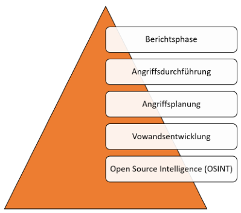

# Zusammenfassung Social Engineering

# Inhaltsverzeichnis

## 1.2 Definition Social Engineering

Beschreibt jede Handlung, die Person beinflusst, eine Handlung zu unternehmen, in gutem als auch schlechtem Interesse

## 1.3 Geschichte und Motivation

Prinzip:Annahme, dass
ein Mensch wie eine Maschine verbessert werden kann: Optimierung von Menschen

Kontext InfoSec: gezielte Manipulation von Einzelpersonen oder Gruppen

Motivation unterschiedlich: 

- soziale Gründe: Rache, Spaß, Macht
- professionelle Gründe: Industriespionage, Identitätsdiebstahl

## 1.4 Social Engineering im Alltag

- Informationen sind der Schlüssel
- Vertraue, aber überprüfe
- Informationen begrenzen und überwachen

# Angriffsmechanismen

## 2.1

### 2.1.1 Vorurteile und Klischees

- Denken ist der Feind des Social Engineerings
- Schwangere Frauen: Inbegriff für Gutes
- Personen it irischem Akzent: gastfreundlich, lustig, gesellig

### 2.1.2 Einordnung von Charaktertypen

Einschätzen von Charaktertypen und Wählen der richtigen Strategie

Unterscheidung Kommunikationsstil: Rolle autoritär oder zurückhaltend wählen.

### 2.1.3 Social Engineering und die Psychologie

Grundlagen der Psychologie

#### Reziprozität

Gegenseitigkeit oder Wechselbezüglichkeit und stellt ein Grundprinzip menschlichen Handelns dar.

Prinzip:
- Person A erweist Person B eine Gefälligkeit
- Anschließend verlangt Person B eine Gefälligkeit zurück

#### Konsistenz

Wenn ENtscheidung bewusst getroffen wurde, treten intra- und nterpsychische Vorgänge ein.

- Motiv der Konsistenz so groß, dass etwaige Umentscheidung verworfen wird, um nach außen konsistent zu wirken.

#### Soziale Bewährtheit

Verhalten anderer wird als richtig angenommen und ggf. kopiert. Wirkt besonders stark, je mehr Unsicherheit und Unklarheit involviert ist.

#### Sympathie

Attraktiven Menschen werden positive Eigenschaften zugeschrieben. 

- Gleiche Kleidung
- Gleiche Herkunft
- ...

sorgen für Sympathie mit anderen.

#### Autorität

Faktoren:

- Titel
- Uniformen
- Luxus

#### Knappheit

Einschränkung von Verfügbarkeit beinflusst Wahrnehmung von Qualität.

Knappheitsprinzip:, Möglichkeiten erscheinen umso wertvoller, je weniger erreichbar sie sind.

#### Abschlussbemerkung 

Ziel ist es, andere dazu zu bringen, eine Entscheidung zu treffen, ohne nachzudenken.

### 2.1.4 Biologische Grundlagen

#### Alpha-/Beta-Modus

Im Alpha-Modus arbeitet Gehirn mit 8 bis 13 cps (zyklen pro Sekunde) :arrow_right: Tagträumen, enstspannen, fokussierte Konzentration

Im Beta-Modus 14 bis 100 cps. Gehirn ist wach, aufmerksam, nimmt Dinge auf, die um uns herum passieren.

Social ENgineering setzt auf Alpha-Modus. Handeln ohne großes Nachdenken von Vorteil.

Vom emotionalen Denken bis zum logischen Handeln dauert es etwa 30 Sekunden. Diese Zeit reicht häufig bereits aus, um Social Engineering zu Nutze zu machen.
Erst danach fällt Betroffenem auf, was er getan hat.

#### Bindungstheorie

Andauerndes affektives Bindungsverhältnis zu bestimmten Personen.

Suchen nach körperlicher und psychischer Nähe.

Bezugsperson hat damit hohen EInfluss auf Entscheidungsfindung einer Person.

#### Oxytocin - The Molecule of Trust

Kuschelhormon. Kann EIgenschaft des Vertrauens hervorrufen

#### Das Experiment rund ums Vertrauen

- Teilnehmern werden 10 Dollar versprochen
- Geld weiter senden wird verdreifacht
  - empfangende Person sendet etwas davon zurück
- Je mehr Geld 2. Person erhält, desto mehr Oxytocin hatte diese Person im Blut
  - Je mehr Oxytoci, desto mehr Geld wurde wieder weitergegeben

Oxytocin verbindet mit anderen, lässt fühlen, was andere fühlen und lässt Menschen großzügiger werden.

#### Dopamin - The Molecule of More

Wichtiger Neurotransmitter und "Botenstoff des Glücks".

Assoziiert mit:

- Kreativität
- emotionaler Intelligenz
- Abenteuerust
- Risikofreude

Besonders Abenteuerlust und Risikofreude für Social Engineering von Vorteil.

- weniger Dopamin verbunden mit Introvertiertheit
- Logisches und Faktenorientiertes Denken
- Sprache oft monoton

Introvertiertes Verhalten und langsames Sprechen kann als Klassifikation genutzt werden.

### 2.1.5 Grundlagen der Kommunikation

#### Non-verbale Kommunikation

##### Kinesik

Beziehung zwischen nicht-sprachlichen Körperbewegungen (Erröten, Zucken, Augenbewegungen) und der Kommunikation :arrow_right: Körpersprache und wie Körper EMmotionen verrät.

##### Embleme

Non-verbale Bewegungen: Daumen Hoch

##### Illustratoren

Gesten, die das Gesagte verstärken (meistens peripher und unbewusst eingesetzt)

##### Manipulatoren

Jede Bewegung, die Manipulation oder Pflege eines Körperteils oder Kleidungsstücks aufgrund von Nervosität.

##### RGLT

Rhythmus, Geschwindigkeit, Lautstärke, Tonhöhe

Bezieht sich auf alles, was das Gesagte umgibt.

- Ausdrücken von Gefühlen
- Emotionen

Mögliche Umsetzungen

- Pronomen Wechsel: ich zu wir
- Stottern: evtl. Angst
- Veränderu ng Stimmlage: Emotionen zur Geltung bringen
- Fragen ausweichen
- Pausen machen

#### Proxemik

Nutzung des Raums

- öffentlicher Raum: Abstand von 3,5 - 7,5 Meter als akzeptabel eingeschätzt
- sozialer Raum: 1,2 - 3 Meter als angemessen eingeschätzt
- persönlicher Raum: als akzeptabel eingeschätzter Raum bei Familie, Freunden oder in Warteschlangen: 0,6 bis 1,2 Meter
- Intimer Raum: 30cm

#### Berührung

- Integraler Bestandteil menschlicher Erfahrungen
- Umarmung zur Freisetzung von Oxytocin

##### Beruhigungsgesten

- Folgen oft auf Situationen, in denen Unbehagen ausgelöst wird
- Häufig Berühren an Hals und Nacken
  - Oft Zeichen für Druck, Bedrohung, Unwohlsein, Unsicherheit, Nervosität
- Durch Berührung werden beruhigende Endorphine im Gehirn ausgeschüttet und man entspannt sich in Folge

##### Laszive Geste

Werden eingesetzt um:

- Aufmerksamkeit
- Interesse
- Nähe
- Hoffnung

zu symbolisieren.

Beispiele:
- Selbstberührung in Gesicht, Haaren und Armen
- Spielen mit Kleidung
- Schulterzucken
- Klimpern mit Wimpern

##### Authentizität von non-verbalen Signalen

- Beine und Füße wichtiger Faktor
- Authentizität nimmt von unten nach oben am Körper ab
- Verkreuzte Beine stehen für Wohlfühlen
  - limbisches System erlaubt diese Geste nur, wenn das Gefühl von Sicherheit anherrscht
- Gespräch zwischen 2 Personen, O berkörper zeigen zueinander, Füße jedoch in eine andere Richtung, Indiz für Wunsch, an einem anderen ort zu sein

#### Augenkontakt

Ausruck verschiedener Bedeutungen:

- Lügen
- Dominanz
- Flirten
- Unbehagen

#### Geruchsstoffe
Assoziation mit Emotionen und Gefühlen.

Mögliche hervorzurufende Emotionen:

- Ekel
- Angst

Social Engineering niemals Körpergeruch aussetzen, außer Vorwand lässt dies zu.

#### Musik

- Musik kann Auslöser starker Emotionen und Gefühlen sein
- Außerdem können Lieder an bestimmte Situationen erinnern
- Forscher konnten erhöhte Dopamin Ausschüttung nachweisen

Gezieltes Einsetzen von Musik kann das Verhalten einer Person beeinflussen

#### Verkleidung

- Kleidungsstücke oder Namensschilder, die Eindruck auf Leigimität der Handlung/Bitte bewirken sollen
- Kann Schlussfolgerungen verursachen
  - Arztkittel
  - Malerkittel

#### Gesichtsausdrücke

Menschliches Gesicht enthält viele Informationen zu Gefühlen der Personen.

Furcht, Freude, Trauer und Überraschung (von links nach rechts)

Emotionen erzeugen neben inneren Signalen auch von Außen sichtbare Veränderungen :arrow_right: Mimik

*Microexpressions*
Kurze und subtile Mimik zu verstehen, die dauert normalerweise 1/25 bis 1/5 einer Sekunde und offenbart eine Emotion, die eine Person zu verbergen versucht.

## 2.2 Methoden des Social Engineerings

- Human-Based
  - Erolgt mithilfe von sozialer Interaktion und sozialen Beziehungen
- Computer-Based
  - Erfolgt durch technische Hilfsmittel. E-Mail Anhänge oder manipulierte Inernetseiten
- Reverse Social Engineering
  - Opfer wird dazu gebracht freiwillig und aktiv gewünschten Informationen zu übermitteln

### Open Source Intelligence (OSINT)

OSINT nutzt freie, verfügbare, offene Quellen wie Printmedien und TV, Internet zur Sammlung von Informationen, die anschließend zur Gewinnung von Erkenntnissen genutzt werden.

### Vorwandsentwicklung

- Basierend auf Erkenntnissen der OSINT-Phase sollen Vorwände geschaffen werden
- Auswahl  der passenden Hilfsmittel und/oder Tools

### Angriffsplanung

Planung zu:

- Was ist der Plan?
- Wann ist der beste Zeitpunkt für den Angriff?
- Wer muss für Unterstützung bereit stehen?

### Angriffsdurchführung

### Berichtsphase

Ergebnisse dokumentieren

### 2.2.1 Open Source Intelligence (OSINT)

- Wichtiger Aspekt des Social Engineerings
- Ausgang und Stützpunkt jedes Social Engineering Angriffes

Jede Art von Information hat einen Wert

#### Nicht technische Open Source Intelligence

- Physikalische Beschattung
  - Nachstellen
  - Beobachten
  - Belauschen

:arrow_right: Auskundschaften von Routinen, Zeitplänen,  Vorlieben, Abneigungen

##### Dumpster Diving

Müll durchforsten

##### Social Media

##### Robots.txt

##### Fotos und Meta-Informationen

##### Telefon

##### Personensuchmaschinen (Identity Resolution Engines)

##### Ein- und Ausgänge (Gebäude)

##### Zusammenfassung

- Daten größtes Kapital eines Social Engineers
- Sammeln von Daten häufig mühselig
- Entscheidend für die Angriffsplanung
- Diskreter Ablauf
- Profilerstellung

### 2.2.2 Vorwandsentwicklung (Pretexting)

- Schritt, sich als jemand Anderen auszugeben, um an private Informationen zu gelangen
- Schaffung einer neuen Identität
  - Oder Annehmen einer anderen Identität

Prinzipien:
1. Stets an Ziele denken
   1. Wahl der richtigen Identität
   2. OSINT als Basis für richtige Wahl der Person
2. Realität vs. Erfindung verstehen
   1. Nicht in Details verlieren 
3. Grenzen kennen
4. Verlust des Kurzzeitgedächtnisses
5. Unterstützung für das Pretexting
   1. Überlegen von Antworten im Vorhinein
   2. Im Vorhinein üben

### 2.2.3 Angriffsplanung

#### Rapport
Bezeichnet eine aktuell vertrauensvolle, von wechselseitiger empathischer Aufmerksamkeit getragene Beziehung, d. h. „guten Kontakt“ zwischen zwei Menschen.

##### Der Tribe

Bezeichnet alle Identifikationsmerkmale

#### Prinzipiehn beim Aufbau von Rapport

1. Künstliche Zeitbeschränkungen
2. Die non-verbale Kommunikation anpassen
3. Herabgesetzte Sprechgeschwindigkeit
4. Sympathie- oder Hilfethemen
5. Das Ego beiseitestellen
6. Bestätigung
7. Wie-, Wann- oder Warum-Fragen stellen
8. Quid pro quo
9. Gegenseitiger Altruismus
10. Umgang mit den eigenen Ansprüchen

### Künstliche Zeitbeschränkungen

- Zeitspanne kurz halten, um zeitlichen Druck zu erzeugen
- Fluchtweg Konversation zu beenden

### Die non-verbale Kommunikation anpassen

- Non-Verbale Körpersprache an Situation anpassen

### Herabgesetzte Sprechgeschwindigkeit

### Sympathie- oder Hilfethemen

### Das Ego beiseitestellen

- Gedanken, Meinungen, ... anderer zu akzeptieren
  - auch wenn sie nicht der eigenen entspricht
  - 

### Bestätigung

- Leuten Bestätigung in ihrer Meinung/Argumentation geben
- Ausschüttung von Dopamin und Oxytocin

### Wie-, Wann oder Warum-Fragen stellen

- Details erfahren
- Denkweise anderer erfahren

### Quid pro quo

- genügend von sich selbst preisgeben, sodass Zielperson das Gefühl hat, Sie asureichend zu kennen

### Gegenseitiger Altruismus

- Gegenseitiges Tür aufhalten
- Gefühl, dass man sich für etwas revanchieren muss

### Umgang mit den eigenen Ansprüchen

- Methoden nicht überschreiten
- Übermut kann Rapport wieder vernichten
- Rechtzeitig beenden

:arrow_right: Wichtigster Grundsatz beim Rapport: Vertrauen durch Gleichheit herzustellen

### Der eigene Name

- Namen haben starken Einfluss
- leichtaussprechbare Namen haben einen positiven Effekt

### 2.2.4
#### Angriffsdurchführung

##### Ködern (Baiting)

- Kostenlose Geschenke

##### Durchschlüpfen (Tailgating)

Zugang zu physisch verschlossenen Bereichen erlangen, indem man hinter einer berechtigten Person durch eine Tür schlüpft.

##### Spam E-Mails

##### Phishing

- Traditionelles Phising
  - generische Mails
  - Einfache Zustellmechanismen
  - Große Menge an Zielen
- Spear-Phishing
  - Personalisierte Tools
  - Nutzung moderner Mechanismen (TLS)
  - Individueller Angriff auf Einzelpersonen

#### Smishing und Vishing

Smishing

- Stehlen von Daten mittels SMS
- Weiterleiten auf  betrügerische Seite

Vishing

- Angriff mittels eines Anrufs

#### Technische Unterstützung

- Social Engineer Toolkit (SET) (Kali Suite)
  - Erstellung von Phising Webseiten
- Burner Phone (Wegwerfhandys)
- Caller ID Spoofing
- Kamera
- GPS Tracker
- Lock Picking
- Aufnahmegerät
- RFID-Analyse
  - emulierene, klonen

### 2.2.5 Berichterstattung

- Letzte Phase
- Wissen für Auftragsgeber

## 2.3 Bekannte Angriffe

- Twitter Bitcoin Scam
- CEO-Betrug bei Leoni
- Präsidentschaftswahl E-Mail Leak
- Toyota Boshoku Corporation BEC attack (Business-Email-Compromise)
- Yahoo Datendiebstahl

### Auswirkungen - Schadenspotenzial

- Finanzieller Schaden
- Reputation

# Abwehrmechanismen

## 3.1 Security Awarenes

Bewusstsein für das Thema Sicherheit entwickeln

- Zusammenspiel von Wissen, Können, Wollen
- Sensibilisieren gegen Sicherheitsbedrohungen im Alltag

### 3.1.2 Wie wird Security Awareness vermittelt?

- Training
- Lesen
- Hören

### 3.1.3 Security Awareness evaluieren

- Fragebögen

#### Security-Awareness-Testing

- Mittels Phising Simulationen
  - Schafft Transparenz
  - Erhöht Security Awareness

## 3.2 Technische und organisatorische Maßnahmen

### 3.2.1 Zugangskontrolle

- Passwörter
- Passwörter und Passwortkomplexität
- MFA

### 3.2.2 Zutrittskontrolle
Fingerabdruck
- Iris- oder Netzhautscan
- Handflächenabdruck
- Handvenenerkennung
- Gesichtsmerkmale

Kombination schafft hohe Sicherheit

### 3.2.3 Zugriffskontrolle

Kernkomponente der Datensicherheit

- Wer darf Unternehmensdaten abrufen und verwenden
- Authentifizierung
- Autorisierung
- Abfragen Identität

Einteilung von Daten in:

- Öffentlich
- Intern
- Vertraulich
- Streng vertraulich
- Geheim

#### Informationsentropy

- Informationsgehalt bestimmen
- Shannon Entropie

### 3.2.4 Vorfilterung von Nachrichten

- Durch Beschränkung des Empfangs von Nachrichten, kann die Empfänger verschont bleiben
- Spam-Filter

### 3.2.5 Umgang mit auffälligen Handlungen

- Benachrichtigung von Fachleuten

## 3.3 Regulatorische Maßnahmen
